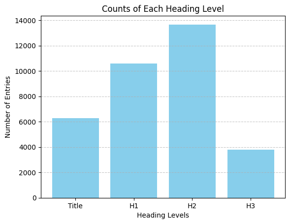
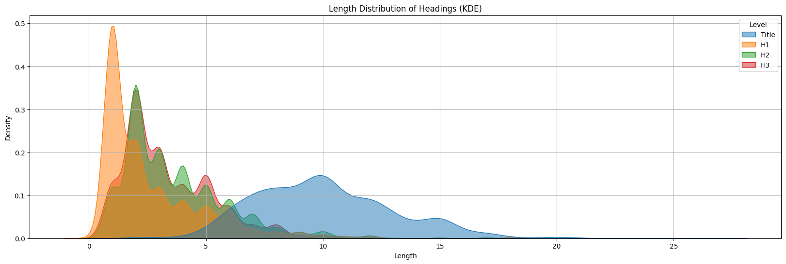

# FunPDFs - Classifying headings from PDFs of research papers

## 📄 Overview

This project implements a classification model that identifies structural elements (e.g., Title, Section, Subsection, Subsubsection) from research papers. The dataset was curated by parsing ~1,400 LaTeX source files of research papers from [arXiv](https://arxiv.org), followed by training a machine learning pipeline using TF-IDF vectorization and Logistic Regression.

---
## 🧾 Dataset Preparation

- **Source**: Parsed LaTeX files from approx. 1,400 research papers across different scientific domains.
- **Parsing Method**:
  - `\title{}` → `Title`
  - `\section{}` → `H1`
  - `\subsection{}` → `H2`
  - `\subsubsection{}` → `H3`
- Extracted header elements and associated them with the corresponding class label.

---

## 🔍 Exploratory Data Analysis (EDA)

Performed EDA to understand the dataset:

- Distribution of classes: Title, H1, H2, H3.
- Token and character length per section.
- Checked for imbalance and noise in the data.

### Class Distribution in Dataset

### Distribution of length of different classes visualised using KDE

---
## ⚙️ Preprocessing

- Removed LaTeX commands and preserved text structure markers.
- Text normalization:
  - Lowercasing
  - Tokenization (inherently handled by TF-IDF)
  - Optional: Stopword removal, punctuation stripping

---
## 🧠 Model Pipeline

Built using scikit-learn's `Pipeline`. Steps:

1. **TF-IDF Vectorization**
   - Used `TfidfVectorizer` with configurable n-gram and max feature settings.

2. **Logistic Regression**
   - Multi-class classification with `LogisticRegression`.
---

## 📈 Model Performance

The final model was evaluated on an independent test set. Below are the performance metrics:

- **Loss:** 0.1366
- **Overall Accuracy:** 96.4%

| Class   | Precision | Recall | F1-Score | Support |
|---------|-----------|--------|----------|---------|
| H1      | 0.97      | 0.92   | 0.94     | 1586    |
| H2      | 1.00      | 1.00   | 1.00     | 2051    |
| H3      | 0.90      | 0.94   | 0.92     | 1018    |
| Title   | 0.95      | 0.99   | 0.97     | 941     |

**Averages:**

- **Macro avg F1:** 0.96
- **Weighted avg F1:** 0.96

The model demonstrates strong and consistent performance across all section classes.
